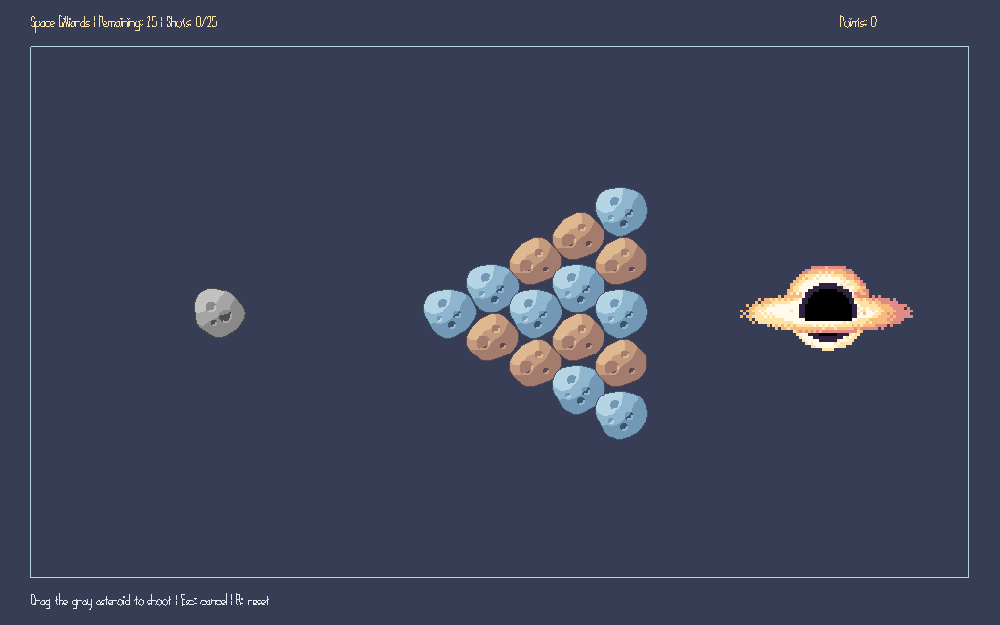

# Space Billiards

- **Author**: Yuchen Zhou
- **Description**: Billiards in space. Shoot the gray asteroid to knock 15 colored asteroids into a black hole. 



# Asset Pipeline

The asteroid and black hole sprites have editable `.aseprite` sources and exported PNGs in [`assets/`](assets/). Export changes to the matching PNG, then build: `Maekfile.js` copies the images into `dist/`, and then the game loads them as textures. The gray cue uses asteroid A converted to grayscale when loaded. The arena, the arrow for aiming, and text are drawn in code.

# Physics

Asteroids bounce off walls and each other. The gray cue keeps its mass, while colored targets receive lighter random masses each round. A small attraction zone near the black hole pulls nearby asteroids in.

[`BilliardsLogic.cpp`](BilliardsLogic.cpp) handles motion, collisions, capture, points, and round results. [`PlayMode.cpp`](PlayMode.cpp) handles input and drawing. Physics runs at a fixed 60 Hz with collision substeps.

# How To Play

1. You control the **gray asteroid**. The 15 colored asteroids are targets you can move by hitting them.
2. **Hold the left mouse button on the gray asteroid, drag backward, and release** to shoot in the opposite direction.
3. You have **25 shots** to clear the targets.
4. Knock targets into the black hole to earn **10 points each**. Your accumulated points appear at the top right.
5. **Clear all 15 targets to win** once the gray asteroid settles safely. **Sinking the gray asteroid loses**.
6. Press **Escape** to cancel aiming or **R** to restart. A short click without dragging costs no shot.

# Build and Run

Set up the course libraries using [NEST.md](NEST.md), then build and start the game:

```sh
node Maekfile.js
./dist/game
```

On Windows, run `dist/game.exe`.

# Notes
This game was built with [NEST](NEST.md).
